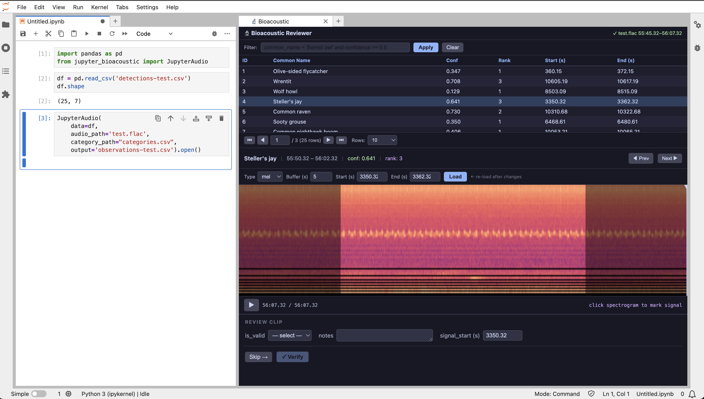
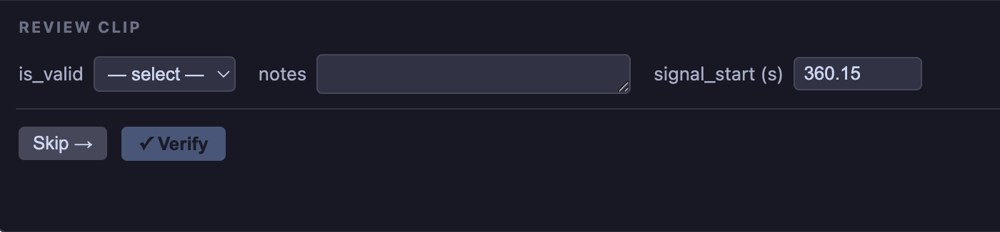
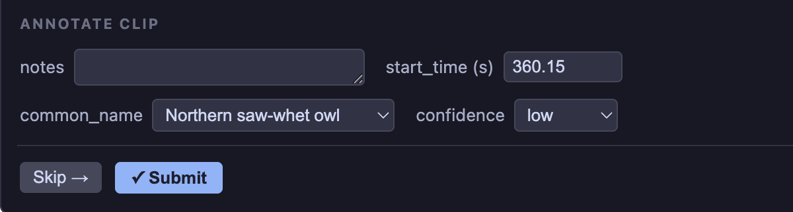

# JupyterBioacoustic

_A JupyterLab plugin for reviewing and annotating bioacoustic audio clips._



Browse a table of audio clips, play each one with a mel spectrogram, and record verification decisions or annotations — all without leaving the notebook. The same widget operates in two modes: **Bioacoustic Reviewer** for validating model detections, and **Bioacoustic Annotator** for labelling clips from scratch.

**Clip table.** An interactive list of clips or detections that lets you:
- Sort by any column and filter with expression syntax — `common_name = 'Barred Owl' and confidence >= 0.5`
- Paginate through large result sets with configurable page size
- Select any row to load the corresponding audio clip and jump to the form

**Spectrogram player.** A visual audio player built around the selected clip's time window:
- Renders a mel spectrogram or plain STFT of the clipped audio segment
- Adjustable buffer window — pads the clip with context on either side
- Semi-transparent overlay marks the region outside the clip window
- Displays the predicted class (reviewer) or any metadata you choose (annotator) in an info card
- Click anywhere on the spectrogram to seek and mark a signal start time
- Play/pause with a real-time position indicator drawn over the spectrogram

**Reviewer form** (verification mode — `prediction_column` set):
- Confirm a detection as valid or mark it as invalid
- When invalid: select a corrected species from a configurable category list and set a confidence level
- Add free-text notes and a precise signal start time; click Verify to write the row and advance

**Annotator form** (annotation mode — no `prediction_column`):
- Assign a species / class from the category list and set a confidence level
- Set a start time by clicking the spectrogram; add free-text notes
- Click Submit to write the row and advance

**Table of Contents**

- [Usage](#usage)
- [Data Schema](#data-schema)
- [Motivation](#motivation)
- [Install](#install)
- [Dev](#dev)
- [License](#license)

---

## Usage

`JupyterAudio` supports two modes controlled by the `prediction_column` parameter.

### Verification mode

Set `prediction_column` to the name of the column in your DataFrame that holds the model's predicted class. The widget will display that prediction in the player, and the form will ask you to confirm or correct it.




```python
import pandas as pd
from jupyter_bioacoustic import JupyterAudio

df = pd.read_csv('detections-test.csv')

JupyterAudio(
    data=df,
    audio_path='test.flac',
    category_path='categories.csv',
    prediction_column='common_name',
    display_columns=['confidence', 'start_time'],
    output='observations-test.csv',
).open()
```

### Annotation mode


Omit `prediction_column` (or leave it as the default `''`). No predicted class is shown in the player and the form asks you to assign a class, confidence, and start time from scratch.



```python
JupyterAudio(
    data=clips_df,
    audio_path='test.flac',
    category_path='categories.csv',
    output='annotations-test.csv',
).open()
```

`display_columns` works in annotation mode too — useful for showing metadata (site ID, recorder unit, region, etc.) in the player info card:

```python
JupyterAudio(
    data=clips_df,
    audio_path='test.flac',
    category_path='categories.csv',
    display_columns=['region', 'aru_id'],
    output='annotations-test.csv',
).open()
```

### Config file

Any parameter can be set in a JSON or YAML file and loaded with the `config` argument. Explicitly passed arguments always take precedence over config file values, so you can keep shared settings in a file and override per-session in the notebook.

```yaml
# config.yaml
data: 'detections.csv'
audio_path: 'recordings/site-a.flac'
category_path: 'categories.csv'
prediction_column: 'common_name'
display_columns: ['confidence', 'rank']
output: 'observations.jsonl'
```

```python
# everything from config
JupyterAudio(config='config.yaml').open()

# override audio_path for a different recording
JupyterAudio(audio_path='recordings/site-b.flac', config='config.yaml').open()
```

Supported config formats: `.json`, `.yaml`, `.yml`. A path with no extension is assumed to be YAML.

### Parameters

| parameter | type | default | description |
|---|---|---|---|
| `data` | DataFrame or str | — | Rows with at minimum `id`, `start_time`, `end_time`. Pass a file path (`.csv`, `.parquet`, `.jsonl`, `.ndjson`) to load directly. |
| `audio_path` | str | — | Local path or `s3://bucket/key` |
| `category_path` | str | `''` | Path to `categories.csv` for the class dropdown |
| `output` | str | `''` | Path where rows are appended on Verify / Submit. Format inferred from extension: `.csv`, `.parquet`, `.jsonl`/`.ndjson`. Defaults to line-delimited JSON for any other extension. |
| `prediction_column` | str | `''` | Column holding the model's predicted class — enables verification mode |
| `display_columns` | list\[str\] | `[]` | Extra columns to show in the player info card |
| `data_columns` | list\[str\] | `[]` | Ordered list of columns to display in the clip table. Overrides the default column selection. |
| `inline` | bool | `False` | Embed below cell instead of opening a panel |
| `width` | int \| str | `'100%'` | Inline widget width (int = px) |
| `height` | int \| str | `900` | Inline widget height (int = px) |
| `config` | str | `None` | Path to a JSON or YAML config file. Any parameter above can be set here; explicit arguments override file values. |

### Features

| Section | What you can do |
|---|---|
| **Filter bar** | Expression filtering: `common_name = 'Barred owl' and confidence >= 0.5` |
| **Clip table** | Sort by any column · paginate (5 / 10 / 20 / custom rows) · click to select |
| **Info card** | Shows time range · prediction (verification mode) · any `display_columns` · Prev / Next |
| **Spectrogram player** | Mel or plain STFT · buffer overlay · play/pause · click to seek and mark signal |
| **Form (verification)** | `is_valid`, notes, signal start time · corrected class + confidence when invalid |
| **Form (annotation)** | start_time, class (from category list), confidence, notes |
| **Skip / Verify / Submit** | Skip advances without writing · Verify/Submit writes to `output` CSV and advances |


---

## Data Schema

### Input

Pass either a pandas DataFrame or a file path string. The only required columns are `id`, `start_time`, and `end_time`; all other columns are optional.

| column | type | description |
|---|---|---|
| `id` | int | unique clip / detection ID |
| `start_time` | float | clip start (seconds from file start) |
| `end_time` | float | clip end (seconds) |
| *(any others)* | — | available for `prediction_column`, `display_columns`, `data_columns` |

Supported input file formats (when `data` is a path string):

| extension | format |
|---|---|
| `.csv` | comma-separated values |
| `.parquet` | Apache Parquet |
| `.jsonl`, `.ndjson` | line-delimited JSON |

### Output

Format is inferred from the `output` file extension. Line-delimited JSON is the default for any unrecognised extension.

| extension | format |
|---|---|
| `.csv` | comma-separated values (header written on first row) |
| `.parquet` | Apache Parquet (read-concat-write on each append) |
| `.jsonl`, `.ndjson`, *(other)* | line-delimited JSON — one JSON object per line |

#### Verification mode — columns written on each **Verify**

| column | description |
|---|---|
| `detection_id` | `id` from the input row |
| `is_valid` | `yes` or `no` |
| `signal_start_time` | absolute position in the audio file (seconds) — set by clicking the spectrogram |
| `notes` | free-text notes |
| `verified_common_name` | corrected species name (empty if `is_valid = yes`) |
| `verification_confidence` | `low` / `medium` / `high` (empty if `is_valid = yes`) |

#### Annotation mode — columns written on each **Submit**

| column | description |
|---|---|
| `detection_id` | `id` from the input row |
| `start_time` | signal start position (seconds) — set by clicking the spectrogram |
| `common_name` | species / class selected from the category list |
| `confidence` | `low` / `medium` / `high` |
| `notes` | free-text notes |


---

## Motivation

Using JupyterGIS as a guide, it's interesting how we might work with bioacoustic data in JupyterLab — either as a plugin ecosystem or as a suite of standalone widgets.

JupyterGIS's foundation is:

- A schema for JSON objects that define what layers exist and the data/sources being displayed
- Code that translates JSON into visual display, allows two-way communication between map layers and Python objects, computes GIS operations (merge / convex hull / simplify / ...), supports real-time collaboration, and turns map interactions into reproducible code

**JupyterBioacoustic** overlaps many of these points, replacing maps with audio tools. If it grew into a full product it could start as a suite of interactive Jupyter plugins.

1. An interactive detection table that lets you filter, sort, and select rows pointing to audio sources and time windows.
2. A spectrogram player that displays the selected clip, plays audio, and supports both verification (confirm or correct a model prediction) and annotation (assign a class from scratch). Similar in spirit to [whombat](https://mbsantiago.github.io/whombat/).
3. *(Future)* Reporting tools — class distributions, confidence stats, progress through the review queue, running accuracy of verified data.
4. *(Future)* Map integration — if detections carry geographic coordinates, display and filter them on an interactive map.

---

## Install

### Requirements

- Python ≥ 3.11
- JupyterLab ≥ 4.0
- [pixi](https://pixi.sh)

### Setup

```bash
git clone <repo-url>
cd jupyter_bioacoustic
pixi run setup   # installs deps, builds TypeScript, registers the extension
pixi run lab     # launches JupyterLab
```

### Test files

Dummy files for testing are available on S3:

```bash
curl -O https://dse-soundhub.s3.us-west-2.amazonaws.com/public/jupyter_bioacoustic/test_files/test.flac
curl -O https://dse-soundhub.s3.us-west-2.amazonaws.com/public/jupyter_bioacoustic/test_files/categories.csv
curl -O https://dse-soundhub.s3.us-west-2.amazonaws.com/public/jupyter_bioacoustic/test_files/detections-test.csv
```

Or regenerate the synthetic detections locally:

```bash
pixi run generate-data
```

### S3 audio

S3 URIs (`s3://bucket/key`) are supported via `boto3` — ensure your AWS credentials are configured before passing an S3 path as `audio_path`.

---

## Dev

### Project structure

```
jupyter_bioacoustic/
├── pyproject.toml                    # build config + pixi task definitions
├── develop.py                        # labextension symlink helper
├── generate_test_data.py             # generates detections-test.csv
├── categories.csv                    # 51 species/class reference rows
└── jupyter_bioacoustic/              # Python package + TypeScript source
    ├── api.py                        # JupyterAudio class
    ├── __init__.py
    ├── package.json
    ├── tsconfig.json
    └── src/
        ├── index.ts                  # plugin entry point
        └── plugin.ts                 # full widget (table + player + form)
```

### Pixi tasks

| task | description |
|---|---|
| `pixi run setup` | full install: jlpm → tsc → labextension build → pip install → symlink |
| `pixi run build` | rebuild TypeScript only (after source changes) |
| `pixi run lab`   | launch JupyterLab |
| `pixi run watch` | watch TypeScript and recompile on change |
| `pixi run generate-data` | regenerate `detections-test.csv` |

> After any TypeScript change: `pixi run build` then hard-refresh the browser.

### How the plugin works

`JupyterAudio.open()` serialises the DataFrame to JSON and stores it in kernel namespace variables (`_BA_DATA`, `_BA_AUDIO_PATH`, etc.), then uses `display(Javascript(...))` to trigger a JupyterLab command or attach a widget to a cell output div.

The TypeScript `BioacousticWidget` reads those variables on attach, populates the table, and for each selected row runs a Python snippet in the kernel that uses `soundfile` (partial file seeking) + `numpy` + `matplotlib` to return a base64-encoded mel spectrogram PNG and WAV segment. No full audio files are ever loaded into the browser.

---

## License

BSD 3-Clause
