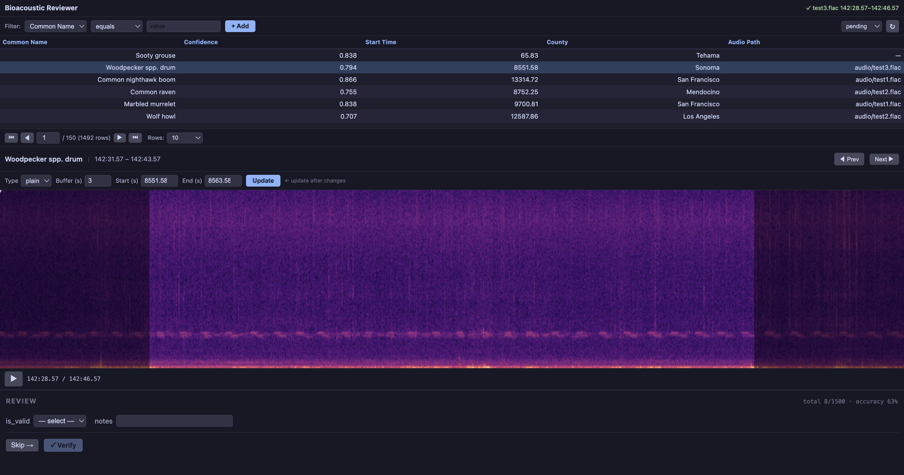
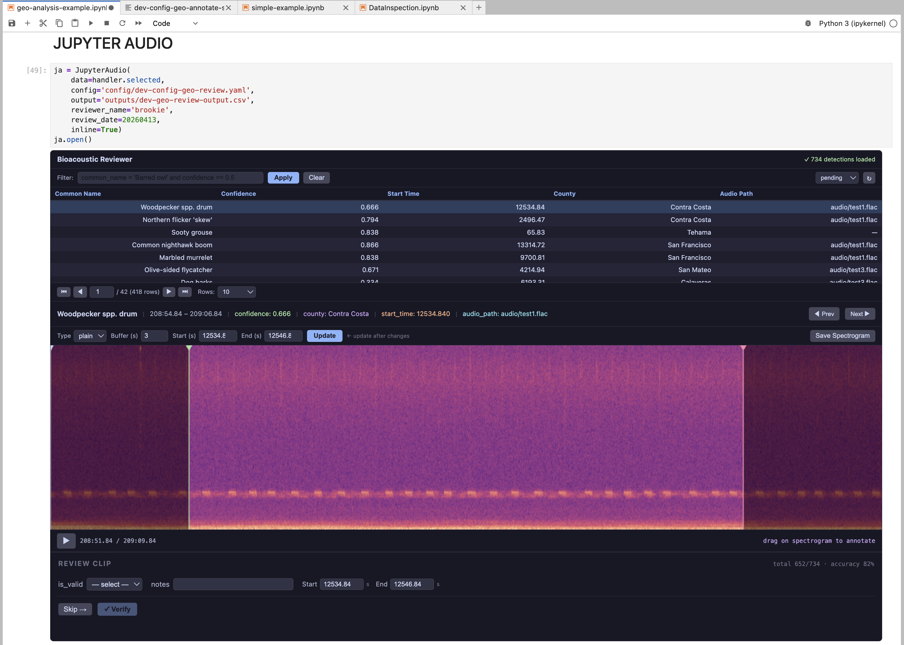

# JupyterBioacoustic

_A JupyterLab plugin for reviewing and annotating bioacoustic audio clips._



Browse a table of audio clips, play each one with a spectrogram, and optionally record verification decisions or annotations — all without leaving the notebook. The form layout is fully configurable via YAML; without a form config the widget is a pure visualizer/player.

**Table of Contents**

- [Install](#install)
- [Quick Start](#quick-start)
- [Features](#features)
- [Documentation](#documentation)
- [Usage](#usage)
- [JupyterAudio Parameters](#jupyteraudio-parameters)
- [Demo](#demo)
- [License](#license)

---

## Install

### From pre-built wheel (fastest)

Download the wheel from a [GitHub Release](https://github.com/SchmidtDSE/dev-jupyter-audio/releases) and install locally. No Node.js or build step needed:

```bash
gh release download v0.1.6 --repo SchmidtDSE/dev-jupyter-audio -p "*.whl" -D dist/
pip install dist/jupyter_bioacoustic-0.1.6-py3-none-any.whl
```

Or in a pixi `pyproject.toml` (after downloading the wheel):

```toml
jupyter-bioacoustic = { path = "dist/jupyter_bioacoustic-0.1.6-py3-none-any.whl" }
```

### For development

```bash
git clone <repo-url>
cd dev-jupyter-audio
pixi run setup   # install deps, build TypeScript, register extension
pixi run lab     # launch JupyterLab
```

### Building a new wheel

After TypeScript or Python changes:

```bash
# 1. Build TypeScript
pixi run build

# 2. Build the wheel (requires the `dev` pixi environment)
rm -f dist/*.whl
pixi run -e dev python -m build --wheel

# 3. Verify
ls dist/*.whl
```

Then tag and create a [GitHub Release](https://github.com/SchmidtDSE/dev-jupyter-audio/releases) with the wheel attached:

```bash
git tag v0.1.6
git push origin v0.1.6
gh release create v0.1.6 dist/jupyter_bioacoustic-0.1.6-py3-none-any.whl \
    --title "v0.1.6" --notes "sql,api,form-filter,dict-params"
```

> **Checklist:**
> - Bump the version in `pyproject.toml` if the API changed
> - Delete old wheels before building (`rm -f dist/*.whl`)
> - Update the wheel filename in downstream `pyproject.toml` files if the version changed

## Quick Start

```python
from jupyter_bioacoustic import JupyterAudio

JupyterAudio(
    data='detections-test.csv',
    audio='test.flac',
    prediction_column='common_name',
    form_config='form-review.yaml',
    output='reviews.csv',
    inline=True,
).open()
```



See the [Quick Start guide](https://github.com/SchmidtDSE/dev-jupyter-audio/wiki/Quick-Start) for test files and more examples.

## Features

| | |
|---|---|
| **Clip table** | Sort, GUI filter builder (column/operator/value dropdowns, filter chips), paginate, configurable columns |
| **Spectrogram** | Plain/mel STFT, buffer overlay, play/pause, capture PNG |
| **Annotation tools** | Draggable time markers, start/end lines, frequency-time bounding boxes |
| **Configurable forms** | YAML-driven: selects, textboxes, checkboxes, conditional sections, progress tracker |
| **Per-row audio** | Each row can point to a different audio file with fallback. S3 partial byte-range reads. HTTPS URLs cached locally (full download on first access). |
| **Output** | CSV, Parquet, or line-delimited JSON with `pass_value`, `fixed_value`, and `**kwargs` |
| **Duplicate prevention** | Reviewed rows faded, read-only results, deletable. Filter by pending/reviewed/all with refresh. |

## Documentation

Full documentation is on the [wiki](https://github.com/SchmidtDSE/dev-jupyter-audio/wiki):

- [Quick Start](https://github.com/SchmidtDSE/dev-jupyter-audio/wiki/Quick-Start) — Installation and first usage
- [Configuration](https://github.com/SchmidtDSE/dev-jupyter-audio/wiki/Configuration) — All parameters, config files, capture, S3, kwargs
- [Configurable Forms](https://github.com/SchmidtDSE/dev-jupyter-audio/wiki/Configurable-Forms) — YAML form layout reference
- [Annotation Tools](https://github.com/SchmidtDSE/dev-jupyter-audio/wiki/Annotation-Tools) — Spectrogram interaction tools
- [Data Schema](https://github.com/SchmidtDSE/dev-jupyter-audio/wiki/Data-Schema) — Input and output formats
- [API Reference](https://github.com/SchmidtDSE/dev-jupyter-audio/wiki/API-Reference) — `JupyterAudio` class, properties, methods
- [Demo](https://github.com/SchmidtDSE/dev-jupyter-audio/wiki/Demo) — Running the demo notebooks
- [Development](https://github.com/SchmidtDSE/dev-jupyter-audio/wiki/Development) — Project structure, build tasks, architecture

## Usage 

The `JupyterAudio` class is has an extremely simple interface; having only two methods (`.open()`, `.output()`) and one property (`.source`).

```python
from jupyter_bioacoustic import JupyterAudio

# Create an instance
ja = JupyterAudio(data='path_to_data.parquet', ...)

# Open the Annotation/Review Interface
ja.open()

# Get a dataframe with all the annotated/reviewed data
# Note: this data is lazy loaded. this will read from 
#       file each time you submit a new review/annotation.
#       however between submissions it will be cached.
verified_df = ja.output()

# Dataframe access to the source data (here 'path_to_data.parquet')
ja.source
```

The parameters for `JupyterAudio` are listed [below](#jupyteraudio-parameters). There is one special parameter `config` that can be used instead of providing the parameter values directly in the notebook. This is a great feature for reproduciblity, organization and avoiding bloated notebooks.  

Consider the example above:


```python
JupyterAudio(
    data='detections-test.csv',
    audio='test.flac',
    prediction_column='common_name',
    form_config='form-review.yaml',
    output='reviews.csv',
    inline=True,
)
```

This can instead be produced this way

```python
JupyterAudio(
    data='detections-test.csv',
    config='config/review-configuration.yaml',
    inline=True,
)
```

```yaml
# config/review-configuration.yaml
audio: 'test.flac'
prediction_column: 'common_name'
form_config: 'form-review.yaml'
output: 'reviews.csv'
```

For this simple example, this might not seem helpful. However for more advanced configurations this is quite useful.  Moreover, in the example above the review-form has a configuration file `form-review.yaml`. If using `config` the form can be included directly.

See [Configuration](https://github.com/SchmidtDSE/dev-jupyter-audio/wiki/Configuration) for full details. Here is an advanced example:

```yaml
# JupyterAudio Args
audio: "audio_path"    # column name — auto-detected (no slashes or dots)
data_columns: ["common_name", "confidence", "start_time", "county", "audio_path"]
prediction_column: 'common_name'
display_columns: ["confidence", "county", "start_time", "audio_path"]
category_path: "data/categories-small.csv"
capture: 'Save Spectrogram'
capture_dir: 'spectrograms'


# Validation Form
form_config:
    is_valid_form:
      - title: 
          value: 'REVIEW CLIP'
          progress_tracker: true
      - is_valid_select: true
      - textbox:
          label: notes
          column: notes
      - annotation:             
            start_time:           
              label: Start        
              column: start_time  
              source_value: start_time
            end_time:     
              label: End
              column: end_time
              source_value: end_time                                
            tools: start_end_time_select                     
    no_form:
      - select:
          label: verified name
          column: verified_common_name
          required: true
          items:
            path: data/categories.csv
            value: common_name
      - select:
          label: verif. confidence
          column: verification_confidence
          items:
            - low
            - medium
            - high
    submission_buttons:
      line: true
      next:
        label: Skip
      submit:
        label: Verify
```

### JupyterAudio Parameters

| Parameter | Type | Default | Description |
|---|---|---|---|
| `data` | DataFrame / str / dict | *required** | Input data. String: file path, URL, `api::url`, or SQL (`SELECT ...`). Dict: `{path\|url\|uri\|api\|sql, secrets, columns}`. |
| `data_path` | str | `None` | Explicit file path for data (overrides `data` source). |
| `data_url` | str | `None` | Explicit URL for data (overrides `data` source). |
| `data_sql` | str | `None` | Explicit SQL query for data (overrides `data` source). |
| `data_api` | str | `None` | Explicit API endpoint for data (overrides `data` source). |
| `data_secrets` | dict or list | `None` | Auth for data loading. `{key, value}` pairs. Value: `env:VAR`, `dialog`, or literal. |
| `data_columns` | list | `[]` | Columns for the clip table. |
| `audio` | str or dict | *required* | Audio source. String: local path, URL/URI, or column name (auto-detected). Dict: `{path\|url\|uri\|column\|sql\|api, prefix, suffix, fallback, secrets, property, response_index}`. |
| `audio_prefix` | str | `''` | Prefix joined with `/` to audio paths. |
| `audio_suffix` | str | `''` | Suffix joined with `/` to audio paths. |
| `audio_fallback` | str | `''` | Fallback when `audio` is a column and the row value is empty. |
| `audio_secrets` | dict or list | `None` | Auth for audio loading (same format as `data_secrets`). |
| `audio_sql` | str | `None` | SQL query to resolve audio path. Requires `audio_property`. |
| `audio_api` | str | `None` | API URL to resolve audio path. Requires `audio_property`. |
| `audio_property` | str | `None` | Field/column to extract from SQL/API response as the audio path. |
| `audio_response_index` | int | `1` | 1-based row index for SQL/API response (1 = first row). |
| `secrets` | dict or list | `None` | Global auth — fallback for both `data_secrets` and `audio_secrets`. |
| `output` | str | `''` | Output file path (`.csv`, `.parquet`, `.jsonl`). |
| `form_config` | dict / str | `None` | Form layout — YAML file, dict, or `None` for no form. |
| `prediction_column` | str | `''` | Prediction column — sets title, info card, capture filename. |
| `display_columns` | list | `[]` | Extra columns in the info card. |
| `duplicate_entries` | bool | `False` | Allow multiple submissions per row |
| `default_buffer` | int / float | `3` | Default buffer time in seconds around each clip |
| `capture` | bool / str | `True` | Capture button (`False` to hide, string for custom label) |
| `capture_dir` | str | `''` | Directory prefix for captures |
| `inline` | bool | `False` | Embed below cell vs split-right panel |
| `config` | str | `None` | Path to YAML/JSON config file |
| `**kwargs` | | | Fixed columns in every output row |

## Demo

Example notebooks are included in the `demo/` directory. They require additional dependencies (ipyleaflet, shapely, seaborn, requests).

### 1. Install with demo dependencies

**With pixi:**
```bash
pixi run -e demo lab
```
This launches JupyterLab with the demo dependencies and sets the working directory to `demo/`.

**With pip:**
```bash
pip install -e ".[demo]"
jupyter lab --ServerApp.iopub_data_rate_limit=1e10
```

### 2. Download audio files (one-time)

Audio files are not included in this repository (they are large FLAC files, ~50-100 MB each).

> **These are large files. It will likely take multiple minutes per file to download.** For demo purposes, you can replace them with any FLAC audio file — the spectrograms will look different but the plugin works the same way.

**With AWS CLI (faster):**

```bash
cd demo
mkdir -p audio
aws s3 cp s3://dse-soundhub/public/audio/dev/20230522_200000.flac audio/test-default.flac --no-sign-request &
aws s3 cp s3://dse-soundhub/public/audio/dev/20230524_200000.flac audio/test1.flac --no-sign-request &
aws s3 cp s3://dse-soundhub/public/audio/dev/20230525_200000.flac audio/test2.flac --no-sign-request &
aws s3 cp s3://dse-soundhub/public/audio/dev/20230526_000000.flac audio/test3.flac --no-sign-request &
wait
```

**With curl:**

```bash
cd demo
mkdir -p audio
curl -o audio/test-default.flac https://dse-soundhub.s3.us-west-2.amazonaws.com/public/audio/dev/20230522_200000.flac
curl -o audio/test1.flac https://dse-soundhub.s3.us-west-2.amazonaws.com/public/audio/dev/20230524_200000.flac
curl -o audio/test2.flac https://dse-soundhub.s3.us-west-2.amazonaws.com/public/audio/dev/20230525_200000.flac
curl -o audio/test3.flac https://dse-soundhub.s3.us-west-2.amazonaws.com/public/audio/dev/20230526_000000.flac
```

### 3. Open a demo notebook

Open `simple-example.ipynb` from the JupyterLab file browser. The notebook demonstrates both review and annotation workflows.

## License

BSD 3-Clause
