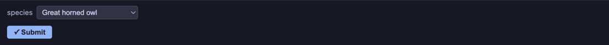
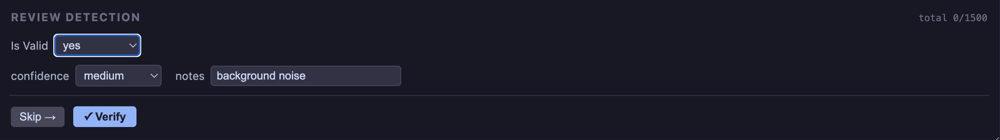
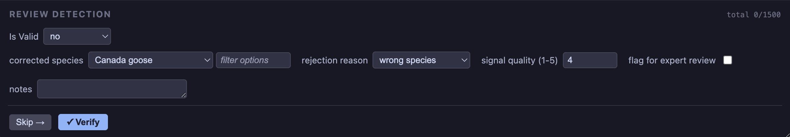

(form-examples)=
# Customizable Forms

Forms are easily configured through YAML. Here is a simple form that adds a species dropdown, where the species names are pulled from a column in a CSV file.

```yaml
form:
    - select:
          label: 'species'
          column: 'common_name'
          required: true
          items:
              path: 'data/categories-small.csv'
              value: 'common_name'
```



---

## Form Structure

Forms are assembled from a small set of composable elements, all configured through YAML. Input elements are placed inside a `form:` list, while structural elements remain at the top level.

**Display** — static elements that show information but do not collect input

- [`title`](https://github.com/SchmidtDSE/jupyter_bioacoustic/wiki/Configurable-Forms#title-and-progress-tracker) — section header with optional progress tracker
- [`text`](https://github.com/SchmidtDSE/jupyter_bioacoustic/wiki/Configurable-Forms#text) — static text displayed in the form
- [`line`](https://github.com/SchmidtDSE/jupyter_bioacoustic/wiki/Configurable-Forms#line) — horizontal rule divider
- `break` — visual spacer between elements

**User Input** — interactive elements inside the `form:` list

- [`annotation`](https://github.com/SchmidtDSE/jupyter_bioacoustic/wiki/Annotation-Tools) — interactive spectrogram tools (time markers, bounding boxes, multibox)
- [`select`](https://github.com/SchmidtDSE/jupyter_bioacoustic/wiki/Configurable-Forms#select-items) — dropdown menu with inline, file-sourced, or range-based items
- [`textbox`](https://github.com/SchmidtDSE/jupyter_bioacoustic/wiki/Configurable-Forms#textbox) — single-line or multiline text input
- [`checkbox`](https://github.com/SchmidtDSE/jupyter_bioacoustic/wiki/Configurable-Forms#checkbox) — boolean toggle with custom checked/unchecked values and optional conditional forms
- [`number`](https://github.com/SchmidtDSE/jupyter_bioacoustic/wiki/Configurable-Forms#number) — numeric input with optional min, max, and step

**Data** — elements that write values to the output without user interaction

- [`pass_value`](https://github.com/SchmidtDSE/jupyter_bioacoustic/wiki/Configurable-Forms#pass_value) — copy a column from the input row to the output
- [`fixed_value`](https://github.com/SchmidtDSE/jupyter_bioacoustic/wiki/Configurable-Forms#fixed_value) — write a constant value to every output row

**Navigation** — form submission and navigation controls

- [`submission_buttons`](https://github.com/SchmidtDSE/jupyter_bioacoustic/wiki/Configurable-Forms#submission-buttons) — configure submit, skip, and previous buttons
- [`dynamic_forms`](https://github.com/SchmidtDSE/jupyter_bioacoustic/wiki/Configurable-Forms#dynamic-forms) — conditional form sections triggered by select items or checkbox state

---

## Examples

### Species Labeling with Notes

A select dropdown sourced from a CSV file, a required checkbox, and a free-text notes field.

```yaml
form:
    - select:
          label: species
          column: common_name
          required: true
          items:
              path: data/categories-small.csv
              value: common_name
              filter_box: true
    - checkbox:
          label: high quality
          column: high_quality
    - textbox:
          label: notes
          column: notes
```

### Confidence Rating

A simple review form with an inline dropdown and a numeric confidence score.

```yaml
title:
    value: RATE CLIP
    progress_tracker: true
form:
    - select:
          label: quality
          column: quality
          required: true
          items: [good, fair, poor]
    - number:
          label: confidence
          column: confidence
          min: 0
          max: 1
          step: 0.1
```

### Time Annotation

Collect start and end times by drawing directly on the spectrogram, pre-filled from the source data.

```yaml
annotation:
    start_time:
        label: start
        column: start_time
        source_value: start_time
    end_time:
        label: end
        column: end_time
        source_value: end_time
    tools: start_end_time_select
form:
    - select:
          label: species
          column: common_name
          required: true
          items:
              path: data/categories-small.csv
              value: common_name
submission_buttons:
    next:
        label: Skip
    submit:
        label: Submit
```

### Dynamic Forms

Dynamic forms show different fields depending on the answers to previous responses. Consider the following config:

```yaml
form:
    - select:
          label: Is Valid
          column: is_valid
          required: true
          items:
              - label: 'yes'
                value: 'yes'
                form: confirmed_form
              - label: 'no'
                value: 'no'
                form: rejected_form
dynamic_forms:
    - confirmed_form:
          - select:
                label: confidence
                column: reviewer_confidence
                items: [low, medium, high]
          - textbox:
                label: notes
                column: notes
    - rejected_form:
          - select:
                label: corrected species
                column: corrected_common_name
                required: true
                items:
                    path: data/categories-small.csv
                    value: common_name
                    filter_box: true
                    custom_value: true
                    not_available:
                        label: Unknown Species
                        value: unknown
          - select:
                label: rejection reason
                column: rejection_reason
                required: true
                items:
                    - noise
                    - wrong species
                    - overlapping signals
                    - too faint
                    - other
```

A validity dropdown that shows a correction form when "no" is selected and asks for confidence and notes when "yes" is selected. Checkboxes can also trigger dynamic forms using `checked_form` and `unchecked_form`:

```yaml
form:
    - checkbox:
          label: flag for expert review
          column: flagged
          checked_form: review_reason_form
dynamic_forms:
    - review_reason_form:
          - textbox:
                label: reason
                column: review_reason
```





