(features)=
# Features Overview

JupyterBioacoustic combines several components into a single widget. Here's what you get out of the box.

## Clip Table

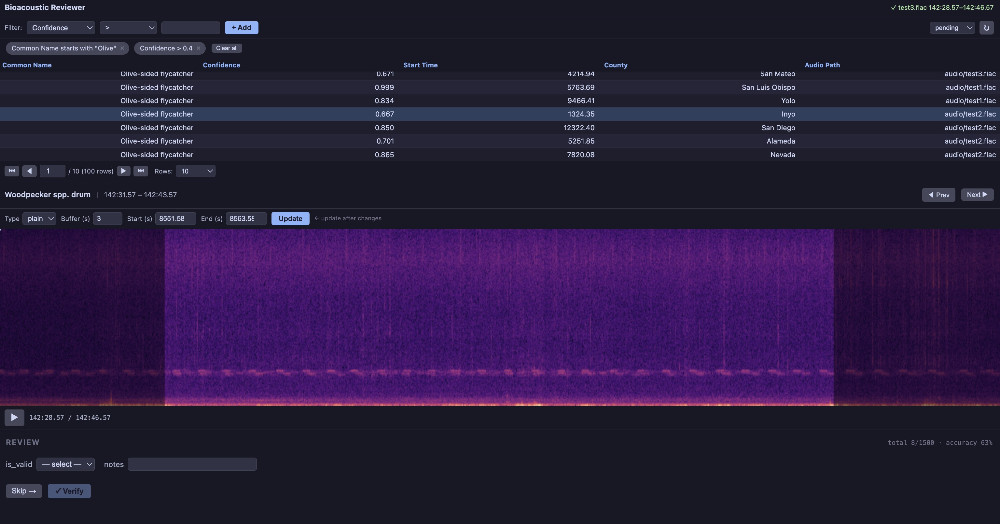

The clip table is the primary navigation interface. It displays your input data as a sortable, paginated table with configurable columns. Click any row to load its audio and spectrogram, or use keyboard navigation (Up/Down to highlight, Left/Right or Enter to select).

**Filtering.** A GUI filter builder lets you narrow the table by any column. Select a column, choose an operator, enter a value, and click **+ Add**. Column types are auto-detected — numeric columns get math operators (`>=`, `<`, etc.) while string columns get text operators (`contains`, `starts with`, etc.). Both types support `is null` / `is empty` checks. Active filters appear as dismissable chips; combine as many as you need with AND logic.

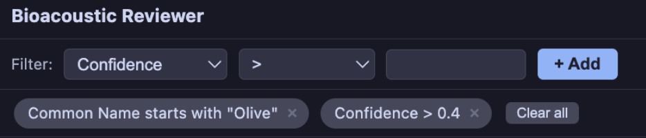

**View modes.** When duplicate prevention is enabled, a dropdown lets you toggle between `pending`, `reviewed`, and `all` rows. Reviewed rows appear with a muted green background.

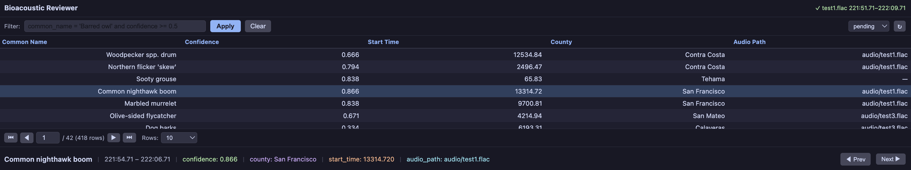

## Spectrogram Player

The spectrogram player renders each audio clip as an interactive spectrogram with playback controls.

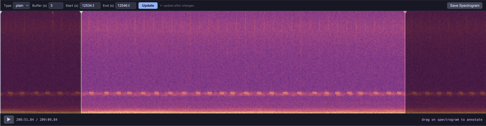

- **Plain or mel STFT** — toggle between linear and mel-scale spectrograms
- **Buffer control** — adjustable buffer time adds context before and after each clip, shown as a shaded overlay
- **Playback** — play/pause with a moving playhead and time display
- **Zoom and pan** — zoom into frequency and time regions using keyboard (`+`/`-`/`0`), the ⬚ zoom-to-selection tool (draw a box), or click-and-drag to pan. A view bounds bar shows the current time and frequency range in real time
- **Configurable resolution** — select the rendering resolution from a dropdown. Zoom in client-side for instant feedback, then re-render at high resolution for a crisp view
- **Capture** — save the current spectrogram view as a PNG with an auto-generated filename

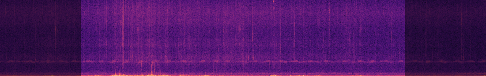

## Annotation Tools

Three interactive tools let you mark positions and regions directly on the spectrogram.

::::{grid} 1 1 2 2
:::{card} Time Select
A single draggable vertical line for marking a point in time.

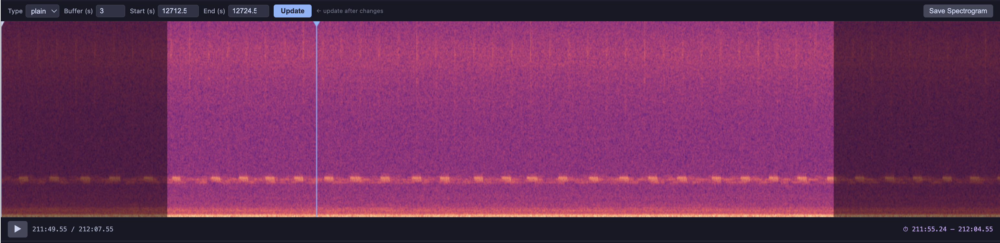
:::

:::{card} Start/End Time
Two constrained vertical lines for marking a time range. Values auto-populate from the source data.

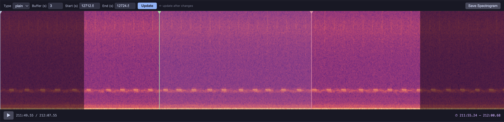
:::
::::

::::{grid} 1 1 2 2
:::{card} Bounding Box
Drag a rectangle to define a frequency-time region. Handles both linear and mel-scale spectrograms.

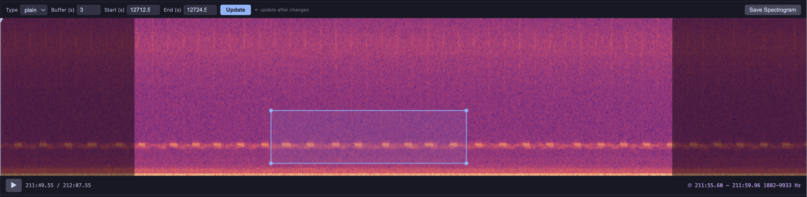
:::

:::{card} Multiple Tools
Enable multiple tools with a dropdown selector. Each tool writes to its own output columns.

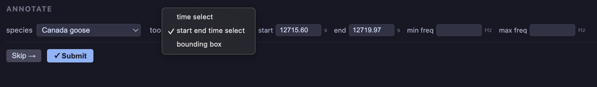
:::
::::

## Configurable Forms

The entire form layout is driven by YAML. The same form system can be used for collecting new data or for reviewing and validating existing data such as model outputs.

Select items can include a `form:` reference to show additional fields based on the user's selection — for example, selecting "no" on a validity check reveals correction fields.

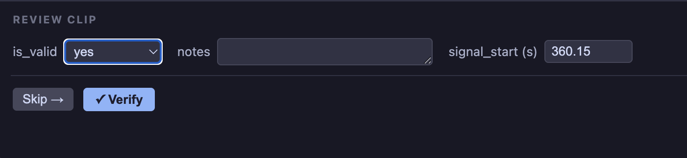

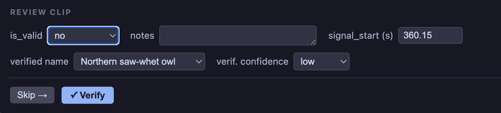

**Form elements** include:
- **Selects** — with items from inline lists, CSV/Parquet files, or integer ranges. Items can reference conditional form sections via `form:`.
- **Textboxes** — free-form notes
- **Checkboxes** — boolean flags
- **Annotation tools** — embedded directly in the form
- **Progress tracker** — session and total counts
- **Fixed values** — constants written to every output row

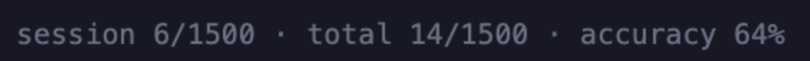

## Keyboard Shortcuts

Shortcuts are active when the corresponding component is focused.

### Spectrogram

| Key | Action |
|---|---|
| `+` / `=` | Zoom in |
| `-` / `_` | Zoom out |
| `0` | Reset zoom |
| Arrow keys | Pan when zoomed |
| `Space` | Play / pause |
| `Shift+Space` | Play from beginning |

### Clip Table

| Key | Action |
|---|---|
| `Up` / `Down` | Move highlight (preview only, no load) |
| `Enter` | Select and load highlighted row |
| `Left` / `Right` | Select and load previous / next row |

### Form

| Key | Action |
|---|---|
| `Enter` | Submit (when all required fields are filled) |

## Duplicate Prevention

When `duplicate_entries=False` (the default), each row can only be submitted once. Reviewed rows are visually faded in the table and show a read-only summary instead of the form. A delete button lets you undo and redo any review.

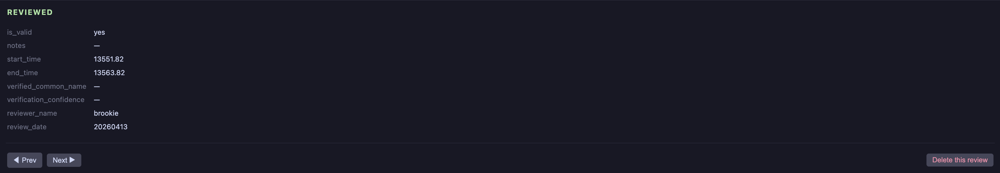

## Data Sources

The `data` parameter accepts multiple source types, auto-detected from the string:

| Pattern | Source |
|---|---|
| `SELECT ...` | SQL query (via DuckDB) |
| `api::https://...` | API endpoint |
| `https://...`, `s3://...` | URL / URI |
| Everything else | Local file path |

Each source type supports authentication through a flexible secrets system (`env:VAR_NAME`, interactive `dialog` prompts, or literal values).

## Per-Row Audio

Each row can point to a different audio file. Set `audio` to a column name and the widget loads the file referenced in each row. S3 URIs use partial byte-range downloads — only the FLAC header and the estimated byte range for the requested segment are fetched, so multi-hour recordings load in seconds. HTTPS URLs are downloaded and cached locally on first access.
