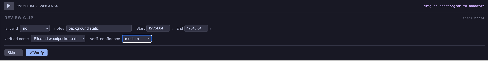

(form-examples)=
# Form Examples

Progressive examples from minimal to advanced. Each shows the code and/or config file used.


## 1. Minimal — single select

A single required dropdown with inline items:

```{embed} myst:form-minimal
:remove-output: true
```




## 2. Review — yes/no with correction

A validity dropdown that shows a correction form when "no" is selected. Uses `dynamic_forms` for the conditional section and `filter_box` for searchable species list:

```{embed} myst:form-review
:remove-output: true
```


## 3. Advanced — config file

A complete review workflow with title, progress tracker, pass_value, conditional sections on both yes and no, multiple element types (select, textbox, checkbox, number), and custom capture settings:

```{embed} myst:form-advanced
:remove-output: true
```

```{literalinclude} ../demo/config/simple-examples-3c.yaml
:language: yaml
```


## 4. Multibox annotation

Multiple bounding boxes per clip, each with its own per-box form (species label). Uses `annotation.form` to reference a `dynamic_forms` section:

```{embed} myst:form-multibox
:remove-output: true
```

```{literalinclude} ../demo/config/annotate-simple.yaml
:language: yaml
```


