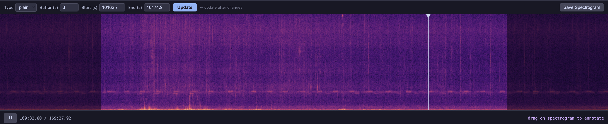

(overview)=
# Overview

## The API

The jupyter-bioacoustic `BioacousticAnnotator` has minimal interface:


```python
from jupyter_bioacoustic import BioacousticAnnotator

ba =  BioacousticAnnotator(...)
ba.open()      # opens the app (inline or in a new tab)
ba.source      # returns the input data as a dataframe
ba.output()    # returns the annotated data as a dataframe
````

## BioacousticAnnotator


`BioacousticAnnotator(...).open()` opens the annotator app within the jupyter-notebook, or optionally as stand alone jupyter-tab. The app itself is made up of three parts

1. [Clip Table](clip-table)
2. [Player and Visulizer](player-and-visulizer)
3. [Form and Panel](form-and-panel)

### Clip Table


The clip table displays your input data as a sortable, paginated table. Click any row to load its audio. Features include:

- **GUI filter builder** — select a column, operator, and value to filter. Multiple filters combine with AND logic.
- **Sortable** — Sort on any column by clicking on its column-name
- **View modes** — toggle between `pending`, `reviewed`, and `all` rows (when duplicate prevention is enabled)
- **Keyboard navigation** — Up/Down to highlight and Enter to select, or Left/Right to select the previous/next clip
- **Customizable** - only show columns of interest and highlight specfic column values for easy identification


### Player and Visulizer



The spectrogram player renders each audio clip as an interactive spectrogram with playback controls:

- **Visualization type** — switch between plain STFT, mel, log-frequency, or [custom visualizations](params) from a dropdown
- **Resolution** — select rendering resolution from the [`spectrogram_resolution`](params) dropdown
- **Buffer** — adjustable time padding before and after each clip
- **Zoom** — `+`/`-`/`0` keys, zoom-to-selection box (⬚), click-and-drag to pan
- **Playback** — play/pause with Space, restart with Shift+Space
- **Capture** — save the current view as a PNG


### Form Panel


The form panel can be easily configured to contain the simplest to the most complex forms for species labeling, time/frequency annotations, reviewing model predictions, and much more:

- **Robust** there are many options for collecting data:
	- `select`: creat simple dropdown box, source by short inline list or offering 100's of options loaded through external file. Optionally all users to filter list by typing in values, and/or save custom values
	- `textbox`: for collect short or log textual inputs
	- `checkbox`: for true/false inputs
	- `spectrogram-annotations`: the user is optionally able to draw a bounding box, mark the start/end_time, as single time marker or draw multiple bounding boxes.
	- `pass_value`: for passing values (unedited) from source to output. This is useful for say, taking and `id` column in the source row and passing it to a `source_id` column in the output file. 
- **Dynamic**: additional form fields may be added based on responses from previous fields 
- **Strict**: fields can be optionally requied. 

See [Parameters & Configuration](params) for the full reference and [Form Examples](form-examples) for progressively complex configurations. On submit, a row is (or rows are) appended to the [`output`](params) file. Results are accessible via `ba.output()`. 

Note that, by default, the app will not allow for a row to be reviewed twice.  However the option to delete an existing review and re-review it is possible


