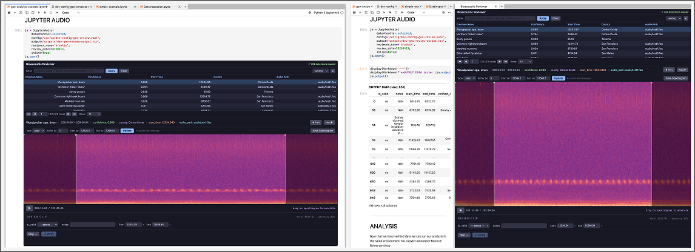

(usage)=
# Quick Example

The `JupyterAudio` class has a simple interface: two methods (`.open()`, `.output()`) and one property (`.source`).

## Visualizer Mode

Without a form config, the widget is a pure audio browser — browse clips, play audio, view spectrograms.

```python
from jupyter_bioacoustic import JupyterAudio

JupyterAudio(
    data='detections.csv',
    audio='recording.flac',
    inline=True,
).open()
```


The widget can also be opened as a split-right panel (the default when `inline=False`), giving you more screen space while keeping the notebook visible.



## Review Mode

Add a `form_config` and `prediction_column` to enable review workflows. The form layout is driven entirely by YAML — selects, textboxes, checkboxes, conditional sections, and progress tracking.

```python
ja = JupyterAudio(
    data='detections.csv',
    audio='recording.flac',
    prediction_column='common_name',
    form_config='form-review.yaml',
    output='reviews.csv',
)
ja.open()
```


Each submission appends a row to the output file. Access results programmatically at any time:

```python
ja.output()     # returns a DataFrame of all reviewed rows
ja.source       # the original input DataFrame
```


## Config Files

For reproducibility, all parameters can be moved to a YAML config file:

```python
JupyterAudio(data='detections.csv', config='config.yaml').open()
```

```yaml
# config.yaml
audio: recording.flac
prediction_column: common_name
form_config:
  is_valid_form:
    - title:
        value: 'REVIEW CLIP'
        progress_tracker: true
    - is_valid_select: true
    - textbox:
        label: notes
        column: notes
  submission_buttons:
    submit:
      label: Verify
    next:
      label: Skip
output: reviews.csv
```

This keeps notebooks clean and makes it easy to share configurations across team members.
