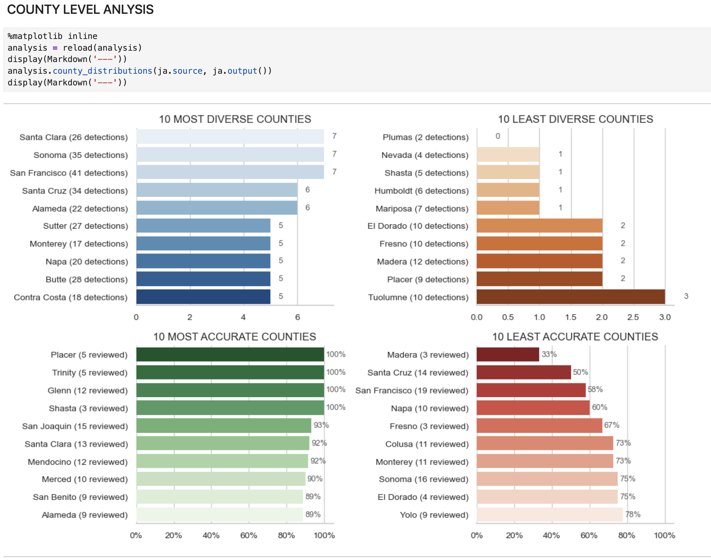

(usage)=
# Overview

## The API

`BioacousticAnnotator` has a minimal interface:

- **1 class** — `BioacousticAnnotator(...)`
- **2 methods** — `.open()` to launch the widget, `.output()` to read submitted data
- **1 property** — `.source` to access the input DataFrame

All configuration is handled through constructor parameters or a YAML/JSON config file. For the full parameter reference see the [wiki](https://github.com/SchmidtDSE/dev-jupyter-audio/wiki/Configuration).


## Examples

The class accepts many parameters, but most have sensible defaults. Here are the simplest configurations — no config files, just Python.


### Player

No form, no data collection — just browse clips and view spectrograms.

```{embed} #nb.simple-examples.1.player
:remove-output: true
```


### Annotation

Add a `form_config` to collect structured data for each clip.

```{embed} #nb.simple-examples.2.annotation
:remove-output: true
```


### Review

The same form system works for validating existing data. Here a validity dropdown triggers a correction form when the user selects "no."

```{embed} #nb:simple-examples.3a.parameters
:remove-output: true
```


## Config Files

The constructor signature and the config file schema are the same — any parameter can go in either place. Config files are recommended for anything beyond the simplest setups: they keep notebooks clean, are easy to version, and can be shared across team members.

This reproduces the review example above using a config file:

```{embed} #nb.simple-examples.3b.config-simple
:remove-output: true
```

```{literalinclude} ../demo/config/simple-examples-3b.yaml
:language: yaml
```

### Advanced Configuration

With a config file, more complex setups are straightforward. This example adds:

1. `data_columns` to control which columns appear in the clip table
2. `ident_column` and `display_columns` for the info card
3. Spectrogram capture with a custom button label and output directory
4. A form title with a progress tracker
5. Conditional sections on both "yes" and "no" selections
6. Multiple form element types: `select`, `textbox`, `checkbox`, `number`

```{embed} #nb.simple-examples.3c.config-advanced
:remove-output: true
```

```{literalinclude} ../demo/config/simple-examples-3c.yaml
:language: yaml
```

## Accessing Results

Submitted data is written to the output file after each submission. Access it programmatically at any time:

```python
ja = BioacousticAnnotator(data='detections.csv', audio='recording.flac',
                   form_config='form.yaml', output='reviews.csv')
ja.open()

# After some submissions...
ja.output()     # DataFrame of all submitted rows (cached, reloads after each submit)
ja.source       # the original input DataFrame
```


